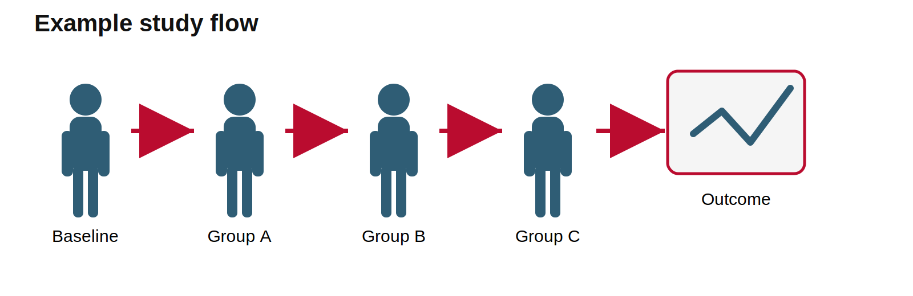
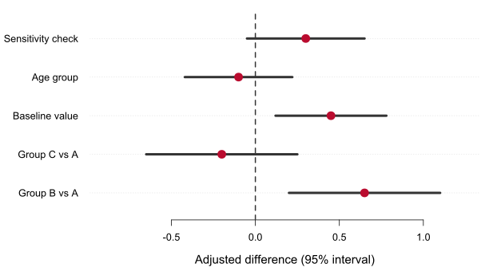

# Introduction

Scientific posters work best when they tell a focused story. Use this first section to state the problem, why it matters, and what gap your project addresses.

This generic starter poster is deliberately more complete than a blank file. Replace the example topic, figures, and tables with your own project-specific material.

**Main question:** How does the exposure, intervention, method, or model being studied affect the outcome of interest?

{width="92%"}

# Methods

## Data or study design

Describe the study population, experiment, simulation, or data source. Keep enough detail for readers to understand what was measured without recreating the entire manuscript.

- Participants, samples, simulations, or observations were selected using transparent criteria.
- The main exposure or grouping variable was measured before the outcome.
- Outcomes were summarized with graphical and model-based comparisons.

Table 1 gives a compact example of the kind of summary table that often belongs on a poster.

| Characteristic | Group A | Group B | Group C |
|---|---:|---:|---:|
| Observations | 240 | 180 | 95 |
| Median age | 42 | 45 | 41 |
| Outcome available | 231 | 172 | 90 |
| Included in model | 225 | 168 | 88 |

: Example baseline or sample-size table. Replace with a project-specific table. {#tbl-summary}

## Analysis plan

Summarize the primary analysis in a few direct statements.

- Compare outcome distributions across groups.
- Estimate adjusted effects with a regression or mechanistic model.
- Report uncertainty intervals rather than only point estimates.
- Check whether conclusions are robust to important assumptions.

# Results

## Descriptive results

{width="100%"}

The first result figure should be easy to understand from a distance. Use direct axis labels, a short caption, and visual emphasis on the most important comparison.

## Model-based results

{width="100%"}

A coefficient plot or uncertainty plot often communicates model results more clearly than a dense table. Clearly mark the null value when relevant.

# Discussion

The main result should be stated plainly. For example: **Group B showed a larger response than Group A after adjustment, while Group C remained uncertain because of smaller sample size.**

- State what changed after adjustment for confounders or baseline differences.
- Mention whether different outcome definitions agree or disagree.
- Identify the most important limitation without overwhelming the reader.

# Conclusions

- Lead with the one finding you want readers to remember.
- Explain why the finding matters for science, practice, or future work.
- Name the next analysis, experiment, or validation step.

::: {.block fill="rgb(245, 245, 245)" inset="10pt" radius="4pt"}

**Take-home message:** Replace this callout with a single-sentence conclusion that a reader can remember after leaving the poster.

:::

# References and contact

1. Author A, Author B. Example paper title. *Journal Name*. 2024.
2. Author C, Author D. Example method or dataset citation. *Journal Name*. 2025.

{width="28%"}

More information: <https://example.org/poster>
