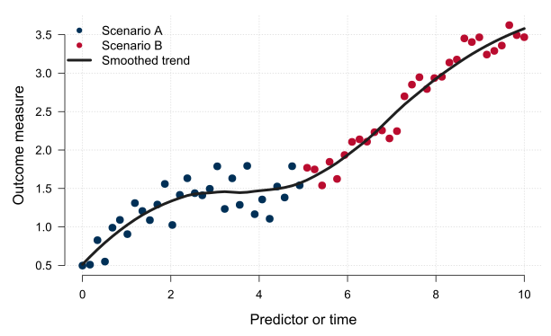
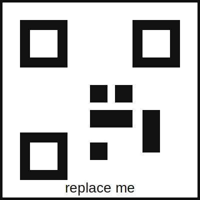

# Background

Use this space to state the problem and why it matters. Posters work best when each section is short and visually scannable.

- What is the scientific or public-health problem?
- What gap does this work address?
- Why should the audience care?

# Objective

::: {.block fill="luma(235)" inset="10pt" radius="5pt"}

**Main question:** Replace this with one focused research question or hypothesis.

:::

Keep the objective concise. A viewer should be able to understand the purpose of the work in a few seconds.

# Methods

Describe the study design, data source, model, experiment, or computational workflow.

1. Define the population, system, or data source.
2. Summarize the main variables, interventions, or scenarios.
3. Explain the analysis or modeling approach.
4. State the main outcome or evaluation metric.

# Results

{width="100%"}

Use short figure captions and make all axis labels readable at poster scale. Vector graphics such as SVG or PDF are usually best.

# Key takeaway

::: {.block fill="rgb(232, 241, 250)" inset="12pt" radius="6pt"}

**One-sentence result:** Replace this sentence with the strongest, clearest finding from the poster.

:::

A good poster usually has one main message. Make that message visually prominent.

# Conclusions

- Main conclusion 1.
- Main conclusion 2.
- Practical or scientific implication.
- Next step or open question.

# Acknowledgements and contact

Acknowledge funders, collaborators, data providers, and contributors who are not authors.

{width="34%"}

Repository / preprint / contact: <https://example.org/poster>
